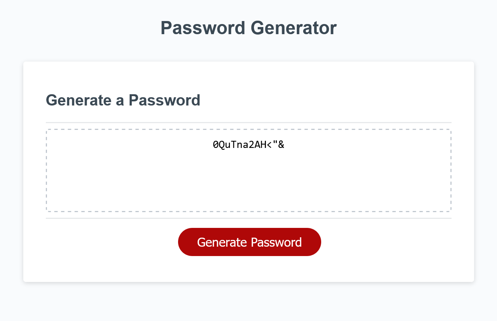

# Boot Camp Challenge 3 - Password Generator

Description
=====
An exercise to create a password generator using JavaScript. Users can select a password length and a variety of different character classes to include in the final password. Characters from each character class are chosen randomly and positioned randomly in the final password.

## Algorithm
The generation algorithm works as follows:
1. The user chooses a password length between 8 and 128 characters (inclusive)
2. The user is asked whether to include each of the following (in order):
    * Lowercase letters (a-z)
    * Uppercase letters (A-Z)
    * Numeric (0-9)
    * Special characters [ !"#$%&'()*+,-./:;<=>?@[\\]^_`{|}~]
3. A character from each chosen character class is randomly chosen
4. The remaining letter allotment is filled with characters randomly chosen from all chosen character classes
5. The chosen characters are then randomly ordered

Demo
=====
Here's a live deployed version of the password generator: [https://kurtbixby.github.io/Boot-Camp-Challenge-03-Password-Generator/](https://kurtbixby.github.io/Boot-Camp-Challenge-03-Password-Generator/).

Credits
=====
__[Kurt Bixby](https://github.com/kurtbixby)__ wrote all the JavaScript except for the writePassword() function.

The rest of the HTML and JS were provided by the UT Austin Web Development Boot Camp as starter assets.
